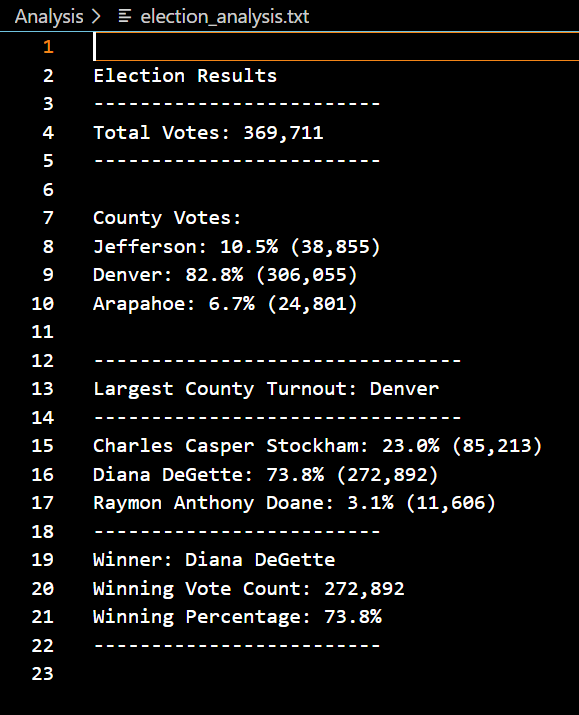

# Election_Analysis

## Overview of Election Audit :

Analysis of Colorado congressional election data using Python to read in a cvs file. Creating an audit and writing the results to a txt file.

#### Expected Output 

## Election Audit Results: 

* Total number of votes that were casted in this election.
    - Total_Votes: 369,711

* Breakdown of number of votes and percentage of total votes for each county each in the precinct.
    - Jefferson: 10.5% (38,855)
    - Denver: 82.8% (306,055)
    - Arapahoe: 6.7% (24,801)

* County that had the largest number of votes.
    - Denver

* Breakdown of votes and percentage of total votes for each canidate 
    - Charles Casper Stockham: 23.0% (85,213)
    - Diana DeGette: 73.8% (272,892)
    - Raymon Anthony Doane: 3.1% (11,606)

* Which candidate won the election with total amount of votes and winning percentage
    - Winner: Diana DeGette
    - Winning Vote Count: 272,892
    - Winning Percentage: 73.8%

 
#### Results as recorded in my elecetion_analysis.txt file

## Election-Audit Python Code Summary:
This code is strong and can be used throughout different states to analyze election data if given the following:
1. a seperate csv file is needed for each election 
2. a seperarte election analysis txt file to write down results
3. this code does not "hard wire" the names of candidtes or counties so it can be versatile to any state

### Resources
* Data Source: election_results.cvs and [students_complete.csv](https://github.com/alorenz465446/Election_Analysis/files/9116945/students_complete.csv)

* Software: Python 3.10.5, Visual Studio Code 1.68.1
